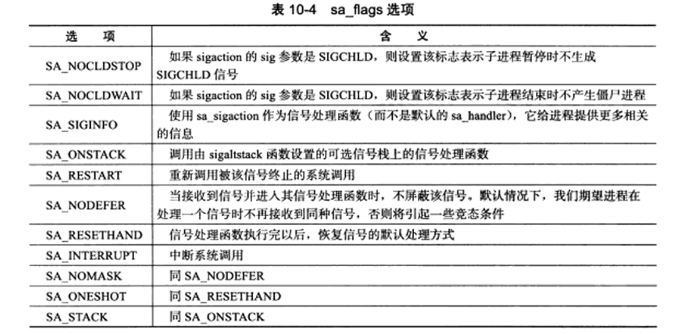

### 信号

#### 信号来源

> * 对于前台进程，用户通过特殊的终端字符来发送信号，比图Ctrl + C通常会给进程发送一个中断信号。
> * 系统异常。例如浮点数异常和非法内存段访问。
> * 系统运行状态变化。例如alarm定时器到期会引起SIGALRM信号
> * 运行kill命令或调用kill函数。

&emsp;&emsp;服务器程序必须处理或至少忽略一些常见信号，避免异常终止。  

#### 中断系统调用

&emsp;&emsp;如果程序在执行处于阻塞状态的系统调用时接收到信号，并且我们为该信号设置了信号处理函数，则默认情况下系统调用将被中断，并且errno被设置为EINTR。可以通过调用sigaction函数为信号设置SA_RESTART标志以自动重启被该信号中断的系统调用。  
&emsp;&emsp;对默认行为是暂停进程的信号，如SIGSITOP、SIGTTIN，如果没有设置信号处理函数，在linux上也可以中断某些系统调用，如connect、epoll_wait。

#### 信号处理函数

```C
#include <signal.h>

_sighandler_t signal(int sig, _sighandler_t _handler)

int sigaction(int sig, const struct sigaction *act, struct sigaction *oact)
```

&emsp;&emsp;上面的两个函数都可以设置信号处理函数。在sigaction结构体中包含了信号处理函数指针,信号掩码（一组信号集）和标志位，标志位指定了程序收到信号时的行为，可选值如下。



#### 信号集

&emsp;&emsp;linux上使用sigset_t来表示一组信号，并提供了一组函数来设置、修改、删除和查询。

```C
#include <signal.h>

int sigemptyset(sigset_t *_set) // 清空信号集
int sigfillset(sigset_t *_set) // 在信号集中设置所有信号
int sigaddset(sigset_t *_set, int _signo) // 将信号_signo添加到信号集中
int sigdelset(sigset_t *_set, int _signo) // 将信号_signo从信号集中删除
int sigismember(_const sigset_t *set, int) // 测试_signo是否在信号集中

int sigprocmask(int _how, _const sigset_t *_set, sigset_t *_oset) // 设置进程掩码
```

#### 被挂起的信号

&emsp;&emsp;通过sigprocmask函数或者sigaction结构体设置进程信号掩码后，被屏蔽的信号将不能被进程接收。如果给进程发送一个被屏蔽的信号，则操作系统将该信号设置为进程一个被挂起的信号，如果取消屏蔽，则进程能立即接收到该信号。

```C
#include <signal.h>
int sigpending(sigset_t *set)
```

&emsp;&emsp;通过上面函数能获取当前信号被挂起的信号集，set参数用于保存被挂起的信号集。

#### 统一信号源

&emsp;&emsp;信号是一种异步事件，很显然信号处理函数需要尽可能快的执行完毕，以确保该信号不被屏蔽太久（信号处理期间，为了避免竞态条件，系统不会再次触发它）。一种典型解决方案是把信号的主要处理逻辑放到主线程的循环中，当信号处理函数触发时，它只是简单通知主循环接收到信号，并把信号值传递给主循环，主循环根据收到信号值执行对应逻辑。通过管道和I/O复用的配合，可以实现信号源统一。

```C
#include <sys/types.h>
#include <sys/socket.h>
#include <netinet/in.h>
#include <arpa/inet.h>
#include <assert.h>
#include <stdio.h>
#include <signal.h>
#include <unistd.h>
#include <errno.h>
#include <string.h>
#include <fcntl.h>
#include <stdlib.h>
#include <sys/epoll.h>
#include <pthread.h>

#define MAX_EVENT_NUMBER 1024
static int pipefd[2];

int setnonblocking(int fd)
{
    int old_option = fcntl(fd, F_GETFL);
    int new_option = old_option | O_NONBLOCK;
    fcntl(fd, F_SETFL, new_option);
    return old_option;
}

void addfd(int epollfd, int fd)
{
    epoll_event event;
    event.data.fd = fd;
    event.events = EPOLLIN | EPOLLET;
    epoll_ctl(epollfd, EPOLL_CTL_ADD, fd, &event);
    setnonblocking(fd);
}

void sig_handler(int sig)
{
    // 保留原来的errno，在函数最后恢复，以保证函数的可重入性
    int save_errno = errno;
    int msg = sig;
    send(pipefd[1], (char *)&msg, 1, 0); //将信号写入管道，通知主循环
    errno = save_errno;
}

void addsig(int sig)
{
    struct sigaction sa;
    memset(&sa, '\0', sizeof(sa));
    sa.sa_handler = sig_handler;
    sa.sa_flags |= SA_RESTART;
    sigfillset(&sa.sa_mask);
    assert(sigaction(sig, &sa, NULL) != -1);
}

int main(int argc, char *argc[])
{
    if (argc <= 2)
    {
        return 1;
    }
    const char *ip = argv[1];
    int port = atoi(argv[2]);

    int ret = 0;
    struct sockaddr_in address;
    bzero(&address, sizeof(address));
    address.sin_family = AF_INET;
    inet_pton(AF_INET, ip, &address.sin_addr);
    address.sin_port = htons(port);

    int listenfd = socket(PF_INET, SOCK_STREAM, 0);
    assert(listenfd >= 0);

    ret = bind(listenfd, (struct sockaddr *)&address, sizeof(address));
    if (-1 == ret)
    {
        return 1;
    }
    
    ret = listen(listenfd, 5);
    assert(ret != -1);

    epoll_event events[MAX_EVENT_NUMBER];
    int epollfd = epoll_create(5);
    assert(epollfd != -1);
    addfd(epollfd, listenfd);

    //使用socketpair创建管道，注册pipefd[0]上的可读事件
    ret = socketpair(PF_UNIX, SOCKET_STREAM, 0, pipefd);
    assert(ret != -1);
    setnonblocking(pipefd[1]);
    addfd(epollfd, pipefd[0]);

    addsig(SIGHUP);
    addsig(SIGCHILD);
    addsig(SIGTERM);
    addsig(SIGINT);
    boll stop_server = false;

    while (!stop_server)
    {
        int number = epoll_wait(epollfd, events, MAX_EVENT_NUMBER, -1);
        if ((number < 0) && (errno != EINTR))
        {
            printf("epoll failure");
            break;
        }

        for (int i = 0; i < number; i++)
        {
            int sockfd = events[i].data.fd;
            //如果就绪的文件描述符是listenfd，则处理新的连接
            if (sockfd == listenfd)
            {
                struct sockaddr_in client_address;
                socklen_t client_addrlength = sizeof(client_address);
                int connfd = accept(listenfd, (struct sockadrr *)&client_address, &client_addrlength);
                addfd(epollfd, connfd);
            }
            //如果就绪的文件描述符是pipefd[0],则处理信号
            else if ((sockfd == pipefd[0]) && (events[i].events & EPOLLIN))
            {
                int sig;
                char signals[1024];
                ret = recv(pipefd[0], signals, sizeof(signals), 0);
                if (-1 == ret)
                {
                    continue;
                }
                else if (0 == ret)
                {
                    continue;
                }
                else
                {
                    for (int i = 0; i < ret; i++)
                    {
                        switch (signals[i])
                        {
                            case SIGCHILD:
                            case SIGHUP:
                            {
                                continue;
                            }
                            case SIGTERM:
                            case SIGINT:
                            {
                                stop_server = true;
                            }
                        }
                    }
                }
            }
            else
            {
                
            }
        }
    }


    close(listenfd);
    close(pipefd[1]);
    close(pipfd[0]);
    return 0;
}
```

